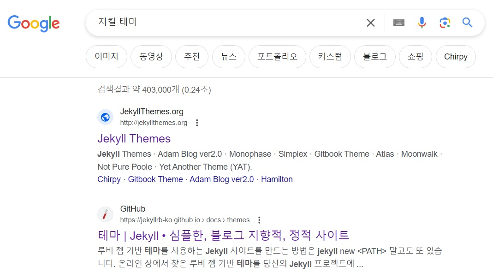
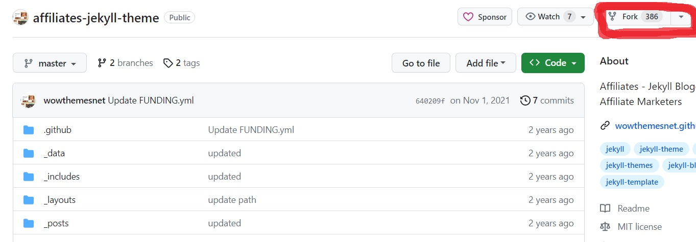
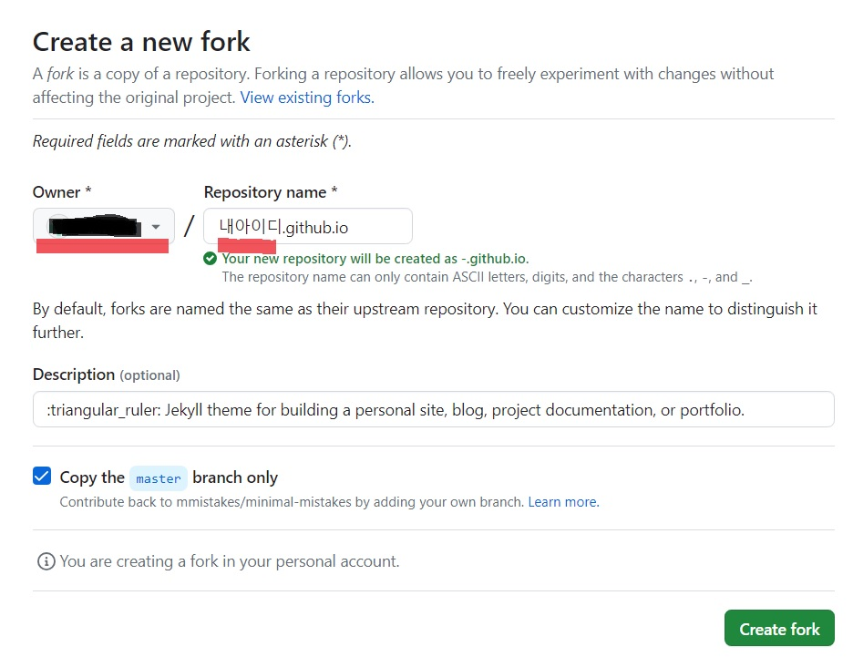
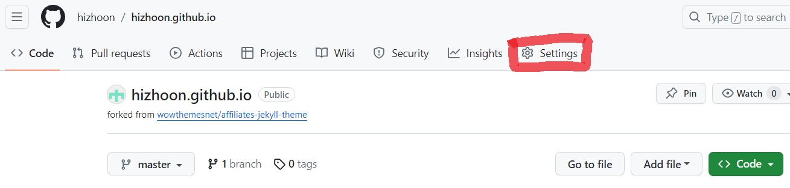
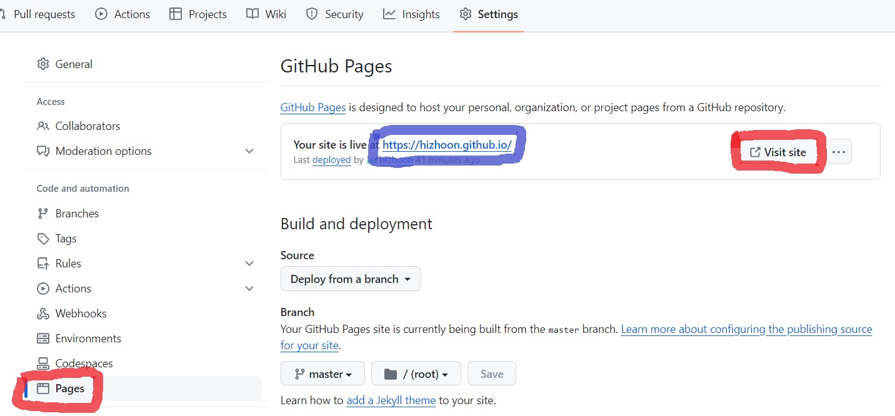

안녕하세요. 지훈입니다.
오늘은 깃허브 블로그 시작하기 1편입니다.

## Step 1. 지킬 테마 검색하기
먼저, 블로그 테마를 정해야 합니다. 처음부터 끝까지 내가 직접 만들어도 되지만, 다른 분들이 만들어 놓으신 예쁜 테마들이 많기 때문에 굳이 어렵게 돌아갈 필요는 없어요!

'지킬 테마'라고 검색하면, 진짜 많은 테마가 나옵니다. 이 중 하나를 고르시면 됩니다.

> '지킬테마'는 간단히 깃허브 블로그의 테마를 말한다고 생각하시면 됩니다. 블로그만 하실 거라면, 지킬테마에 대해 자세히 알 필요는 없습니다.

## Step 2. 지킬 테마 fork 하기

> 저는 [이 테마](https://jekyllthemes.io/theme/affiliates)를 골랐습니다!

테마 검색을 해서 들어가보면, 위의 사진과 같이 뜰 겁니다. 
2번 버튼 "**Live Demo**"를 누르면, 사이트에 접속해 테마 예시를 직접 확인할 수 있습니다. 포스팅 되어 있는 게시글도 눌러보면서, 어떤 테마인지 확인해보세요!

이제, 테마가 정해졌다면, 1번 버튼 "**Get ~ on GitHub**" 을 눌러 주세요.

> GitHub 가입은 필수입니다! 가입이 안되어 있다면, 가입 후 다시 시도해 주세요.

버튼을 누르고 나면, 이런 화면이 뜹니다. "**Fork**" 버튼을 눌러 주세요.

이 화면이 뜨면, 첫번째 밑줄 "**Owner**"은 자신의 GitHub아이디입니다. 두번째 밑줄 "**Repository name**"에 "내아이디.github.io"를 적어 주시면 됩니다.

제 아이디가 "hizhoon"이므로, 저는 "hizhoon.github.io"를 적으면 되는 거죠! 후에, 이것이 제 블로그 주소가 됩니다.

자, 그럼 이렇게 블로그 초기 안성이 됩니다! 블로그가 잘되는지 확인해 볼게요. 위의 사진에서 "**Settings**"에 들어간 후, "**Pages**"에 들어가면, 파란색 박스에 나의 블로그 주소가 나옵니다. 옆에 "**Visit site**"를 누르면 깃허브 블로그로 이동할 수 있습니다.

잘 만들어졌죠! 그런데, 테마를 그대로 가지고 온거라 아직은 블로그 주인이 내가 아니라 마치 다른 사람 같습니다. 이제 본격적으로 내 블로그로 만드는 방법은 다음 포스팅에 이어 하도록 하겠습니다!
