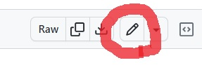

안녕하세요. 지훈입니다.
오늘은 깃허브 블로그 시작하기 2편입니다.

# 깃허브 블로그 내 정보로 수정하기

## Step 3. _config.yml 수정하기
GitHub에 로그인 한 후, 저번 시간에 만들어 놓은 블로그 레포지토리에 들어갑니다. 가장 아래에서 두번째에 "**_config.yml**"이라는 파일에 들어가 주세요.

위에서부터 수정할 부분을 차례대로 알려드릴게요.

오른쪽 상단에 사진의 빨간색 동그라미 펜 모양을 누르면 편집할 수 있습니다.

다 수정한 후에, 오른쪽 상단의 빨간색 동그라미 "**Commit**" 버튼을 누르면 저장됩니다.

**title: " "**  블로그 이름을 정해주시면 됩니다. **email: your_email@example.com**  자신의 이메일을 넣으면 됩니다.

> 이메일이 없다면, 공란으로 비워놓아도 문제 없습니다.

**url: "https://내아이디.github.io"**  블로그 주소를 넣으면 됩니다. **baseurl: " "**  공란으로 만들어주세요.

**logo: 'assets/images/logo.png'** **favicon: 'assets/images/favicon.ico'** "**logo**"는 블로그에 들어가는 로고로, 사진에서 파란색 동그라미를 의미합니다. "**favicon**"은 빨간색 동그라미인 조그만 아이콘을 의미합니다. 뒤에 나온  'assets/images/logo.png' 은 이미지 경로를 의미하며, 로고와 favicon을 변경하고 싶다면, assets파일의 images안에 이미지를 저장해 놓은 후 경로를 바꾸시면 됩니다.

>  'assets/images/logo.png'
>  = "assets파일 안의 images파일 안의 logo.png" 라는 의미입니다.

**author: your_name**  블로그에서 글을 쓰면, 이 이름의 작성자로 글이 올라갑니다.

**locale: ko_KR** **lang: ko_KR**  대한민국에 맞게 바꿔줘야 합니다.

그 아래, "**authors**" 부분이 있습니다. 작가 한 명 빼고 모두 없앤 후에, 작가 한 명은 나에 대한 정보로 수정하면 됩니다.

그 아래, "**social**"부분이 있습니다. 기재하고 싶다면 해도 되지만, 만약 없거나 비워두고 싶다면, "**null**" 이라고 작성해 주시면 됩니다.

> ex) twitter: null

## Step 4. about.md파일 수정하기

> md파일 작성법을 모르시는 분들은 다음 게시물 "[깃허브 블로그 시작하기 3편](https://hizhoon.github.io/blog04/)" 부터 보고 오시는 게 좋습니다.

블로그의 내비게이션 바를 보면, "about"이 있습니다. 눌러보면, 이 블로그 테마에 대한 설명이 적혀 있죠. 이것을 블로그 주인인 저에 대한 설명으로 바꿀 겁니다.

**pages**파일을 눌러보면, 그 안에 **about.md파일**이 있습니다.

수정하기를 눌러, 수정을 하시면 되는데, 블로그로 보면 글 마지막에 다른 사이트로 이동 가능한 버튼이 있습니다. 저는 이것을 누르면, 저에게 메일을 쓸 수 있게끔 변경을 했는데 원하시는 분은 따라하시면 될 것 같습니다. 버튼을 아예 없애셔도 상관 없습니다.

    [Contact me](mailto:your_email@example.com)
    
이렇게 하면, "contact me"라는 버튼이 만들어지고 그걸 누르면, 이메일 화면이 뜨면서 보내는 이에 저의 이메일이 자동으로 들어가게 됩니다.

이 정도면, 그래도 얼추 블로그가 제 것처럼 보이지 않나요? 다음 시간에는 md파일로 글을 작성하는 방법을 소개하겠습니다. 
