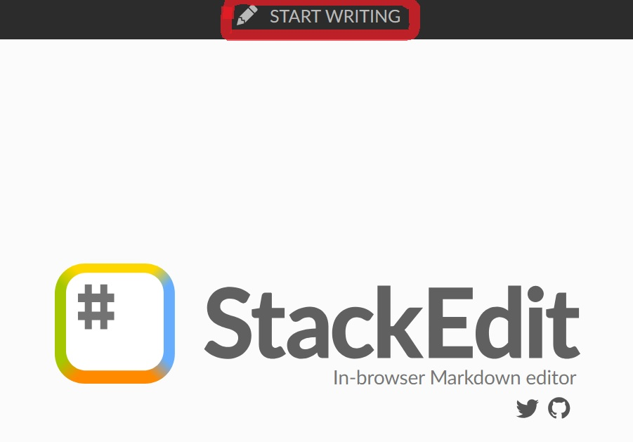

안녕하세요. 지훈입니다.
오늘은 깃허브 블로그 시작하기 3편입니다.

## Step 5. "StackEdit"을 이용하여 글쓰기
깃허브 블로그는 다른 블로그들과 달리 직접 파일로 글을 쓴 후, 올려야 합니다. 그렇기 때문에 컴퓨터가 읽을 수 있게끔 마크다운파일로 글을 작성해야 해요. 처음에는 어려울 수 있지만 이를 도와주는 도구들이 많기 때문에 걱정하지 않으셔도 됩니다.

저는 "**[StackEdit](https://stackedit.io/)**"을 씁니다. 따로 다운받을 필요 없고, 인터넷 상에서 바로 글을 쓸 수 있어 편리합니다.

"START WRITING" 을 누르면, 이제 글을 쓸 수 있는 화면이 나옵니다. 왼쪽이 내가 마크다운 문법으로 글을 쓰는 곳이고, 오른쪽이 마크다운 언어가 변환되어 보여질 실제 화면입니다.

예시들이 나와있기도 하고 몇 번 연습을 해보면 그리 어렵지 않게 도구를 쓸 수 있을 거예요. 그 중에 몇 개만 소개하도록 하겠습니다.

"Stack Edit" 에는 안 나와 있지만, **줄을 건너 뛰는 방법**을 알려 드리겠습니다. 그냥 엔터를 치면, Stack Edit에서는 마치 아랫줄로 내려간 것처럼 보이지만 실제 포스팅 해보면 그렇지 않다는 것을 알 수 있습니다. 따라서, 바로 아랫줄로 한 줄 내려가고 싶을 때는 html 언어를 써야 합니다. ` `을 쓴 후, 다음 문장을 쓰면, 오른쪽 화면에서 다음 문장이 바로 아랫줄로 잘 내려간 것을 확인할 수 있습니다.

**3번째**, **머리제목**으로 이용할 수 있도록 글씨를 두껍게 해줍니다. "#" "##" 여기서는 두 개밖에 없는데, 더 여러개 붙이셔도 돼요. 개수가 적을수록 더 중요하다고 생각되어 더 글씨가 크고 굵습니다. "#" 뒤에 한 칸을 뛰고 글씨를 적어야 적용이 됩니다.

**뒤에서 세번째**, **테이블 표**를 만들 수 있습니다. 실제 눌러보면, 2열 2행밖에 생기지 않습니다. 더 늘릴려면, 직접 표를 이어나가야 하는데요. 이게 좀 어렵다 하시는 분들은 챗지피티로 가셔서 "5열5행 표 마크다운 언어로 만들어줘." 하시면 됩니다. 솔직히 이게 더 빠릅니다. 제가 고른 테마의 가장 큰 단점인데, 마크다운 언어로 표를 작성해도 테마가 표를 만들 수 없더라구요. 그래서 표를 작성하고 싶으면, html 형식으로 테이블 리스트를 넣어야 합니다. 이렇게 했었는데 이러면 파일이 더 복잡해집니다.  그래서 제가 생각해낸 진짜 좋은 방법! 그냥 "Stack Edit"에서 마크다운 언어로 표 만든 후에, 오른쪽에 보이는 표를 캡쳐해 이미지로 사용했습니다. 그럼 깔끔하고 예쁘게 나와요!

**뒤에서 두번째**, **링크**를 넣을 수 있습니다. 눌러보면, url을 넣으라고 나옵니다. 여기에는 실제 눌렀을 때, 이동할 주소를 적어주면 돼요.  예를 들어, 네이버 홈페이지로 이동하고 싶다하면 url에 `"https://www.naver.com/"`을 넣어주면 되죠.

**뒤에서 첫번째**, **이미지**를 넣을 수 있습니다. 눌러보면, 링크처럼 url을 넣으라고 나옵니다. 여기에는 이미지 경로를 넣어주면 됩니다. 블로그에 들어가는 모든 이미지는 아래 사진과 같이 블로그 레퍼지토리 안에 있는 assets 파일에 들어가 있습니다. 

이미지 파일 경로를 적는 방법은 다음 시간에 글을 포스팅하는 방법과 함께 알려드릴게요! 둘이 연결되는 내용이라서요. 다음시간에는 꼭 글 포스팅하는 방법까지 올려보도록 할게요!!
