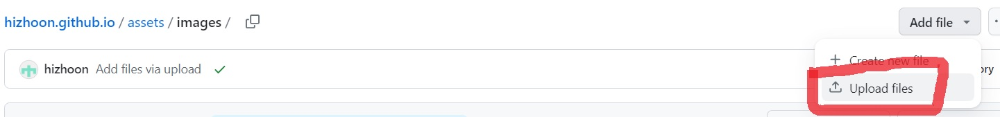
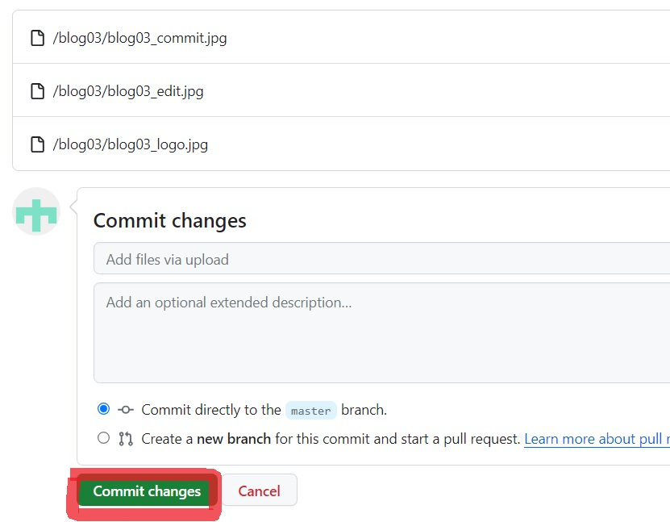
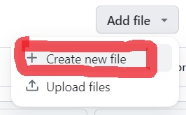
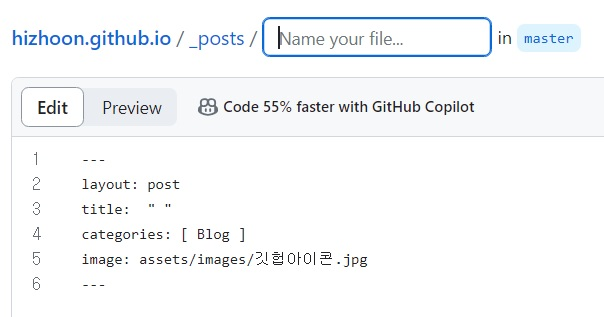
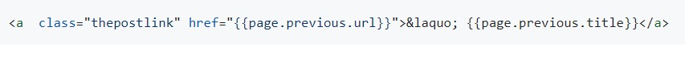
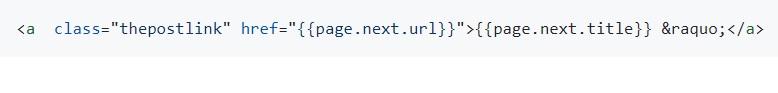

안녕하세요. 지훈입니다.
오늘은 깃허브 블로그 시작하기 4편입니다.

## Step 6. 블로그 글에 들어갈 이미지 Commit하기
블로그 글을 쓰다보면, 글 내에 이미지가 들어갈 수도 있고, 글 썸네일 이미지를 넣는 경우도 있죠. 이처럼 깃허브 블로그에서 이미지를 이용하기 위해서는 이미지를 먼저 commit해 놓아야 합니다.

블로그의 레퍼지토리를 포면 "**assets**"라는 파일이 있습니다. 이 파일을 열어보면, css, images, js 파일이 안에 들어 있는 것을 확인할 수 있습니다. 즉, assets 파일은 블로그의 스타일 꾸미기나, 이미지, 작동 방식 등에 관한 파일임을 알 수 있습니다.

우리는 지금 이미지를 다룰 거기 때문에 **assets** 파일 안의 **images** 파일로 들어가 볼게요.

사진과 같이, 오른쪽 상단의 "**Add file**"을 누른 후, "**Upload files**" 를 눌러 줍니다.

이미지 파일들을 드래그하거나 선택한 후, 왼쪽 하단의 "**Commit changes**"를 눌러 줍니다. 저같은 경우는, 어떤 글에 들어가는 이미지들인지 구별이 가능하도록 한 글에 들어가는 이미지들은 하나의 파일안에 담아 올려줍니다.

자, 이렇게 하면, 이미지를 넣을 준비는 끝났습니다. 다음 단계로 넘어가 볼게요.

## Step 7. 블로그 글 포스팅하기
이제 블로그에 글을 올려 보도록 할게요. 레퍼지토리를 보면, "**_posts**" 라는 파일을 볼 수 있습니다. 그 파일 안에는, 블로그 게시글 파일들이 들어있습니다. 우리도 이 파일 안에서 글을 작성할 겁니다!

"**_posts**" 파일에 들어가서, 왼쪽 상단의 "**Add file**"을 누른 후, "**Create new file**"을 눌러주세요.

그럼 빈 화면이 뜨죠! 거기에 "Stack Edit"에 작성한 내용을 복사 + 붙여넣기를 하면 됩니다. 하지만, 그 전에 해야할 일이 있습니다. 먼저 파일 제목부터 붙이겠습니다.

사진의 파란 박스 "Name your file..." 에 파일 제목을 적으면 되는데 형식이 있습니다. 형식을 따라 파일이름을 적는 게 좋습니다.

    2023-11-20-파일이름.md
    
이 형식을 지켜주면 됩니다. 파일이름 부분은 나 알아서 지으면 됩니다. 예로, 저는 블로그 관련 글들은 blog01, blog02... 이런 식으로 지었습니다!

파일 이름을 정해주었다면, 두번째 할일은 사진에서 보면 1번에서 6번까지의 형식을 적는 겁니다.

    ---
    layout: post
    title:  " "
    categories: [  ]
    image: assets/images/이미지이름.jpg
    ---
    
"**layout**"은 변경할 필요가 없습니다. 저와 다른 테마를 쓰고 계시는 분들은 자신의 테마에 예시로 게시되어 있는 게시글을 확인해주세요. 모든 md 파일 시작은 저 형식이 들어가므로, 그것을 복사 + 붙여넣기 해서 쓰시면 됩니다.

"**title**"은 게시글 제목을 의미합니다. 자신이 원하는 제목을 기입해주세요. "**categories**" 는 게시글을 각 카테고리에 맞게 분류하는 역할을 합니다. 블로그에서 카테고리를 누르면, 각 카테고리의 글들이 분류되서 나오니 잘 생각해서 카테고리를 적어주세요. "**image**" 는 게시글의 썸네일 이미지를 의미합니다. 글과 관련된 이미지를 assets파일 안의 images파일에 먼저 넣은 후, 이미지 경로를 작성해 주면 됩니다.

    image: assets/images/이미지이름.jpg

> assets 파일 안의 images 파일 안의 이미지이름.jpg 를 의미합니다.

Stack Edit 에서 글을 복사 + 붙여넣기를 하다 보면, 중간에 이미지가 있을 수 있죠. 이 이미지 경로 부분이 아직 비어 있을 겁니다. 그 부분을 채워 볼게요.

    ../assets/images/blog03/이미지이름.jpg
    
저는 이미지 경로를 이런 식으로 작성했습니다. 하나의 글에 들어가는 이미지들을 하나의 파일 안에 넣었기 때문에, 이미지 경로에 파일 하나를 더 적은 것 뿐입니다. `../`은 상위 디렉토리를 의미합니다. 

> 저 경로를 해석해 보자면, assets 파일 안의 images 파일 안의 blog03 파일 안의 이미지이름.jpg 를 의미합니다.

글을 다 작성한 후, **Commit Changes**를 누르면, 5초~30초 후, 블로그에 글이 게시됩니다. 

### 게시글 눌렀는데, 404 found가 떴다면
블로그 글이 제대로 나오지 않는 분들은 "**_layouts**" 파일 안의 "**post.html**"에 들어가서 **65번째** 줄을 아래와 같이 변경해주세요.

    
그리고, **70번째** 줄도 아래와 같이 변경해주세요.

> 코드가 자꾸 실행이 되서 부득이하게 이미지로 올렸습니다.
    
"**Commit changes**"를 누른 후, 좀 기다려보면 업데이트가 될 겁니다. 이제 제대로 나올 거예요. 

이렇게 블로그 첫 게시글이 성공했습니다! 여기까지 오느라 수고가 많았지만, 여기서 끝이 아니죠? 블로그가 검색이 되어야 의미가 있죠! 다음에는 네이버와 구글에서 블로그가 검색이 되도록 하는 방법을 포스팅하겠습니다.
