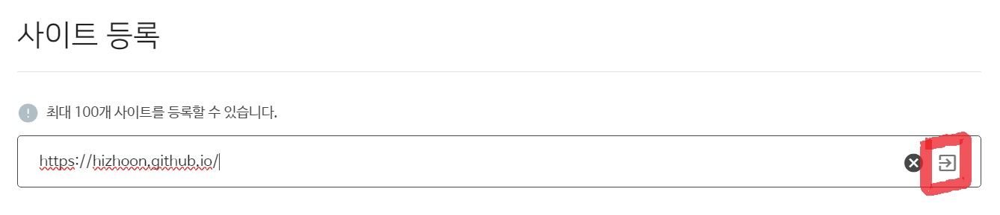
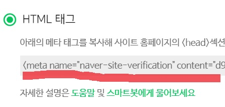
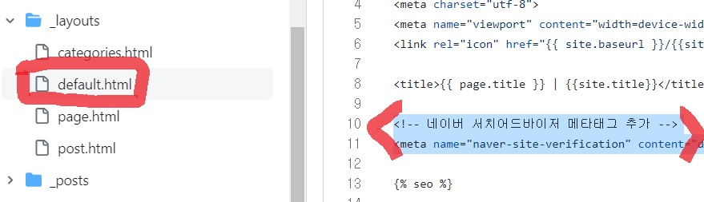
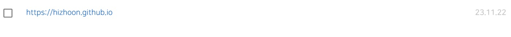
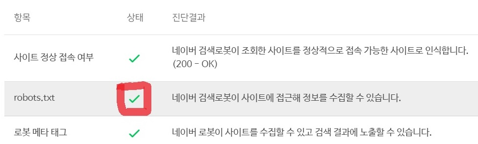
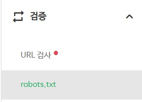
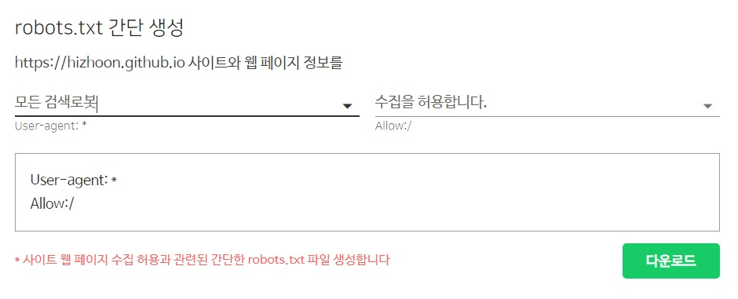
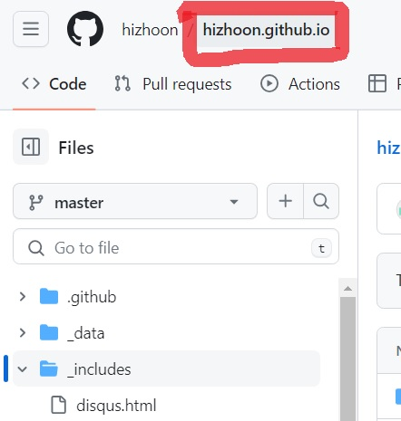
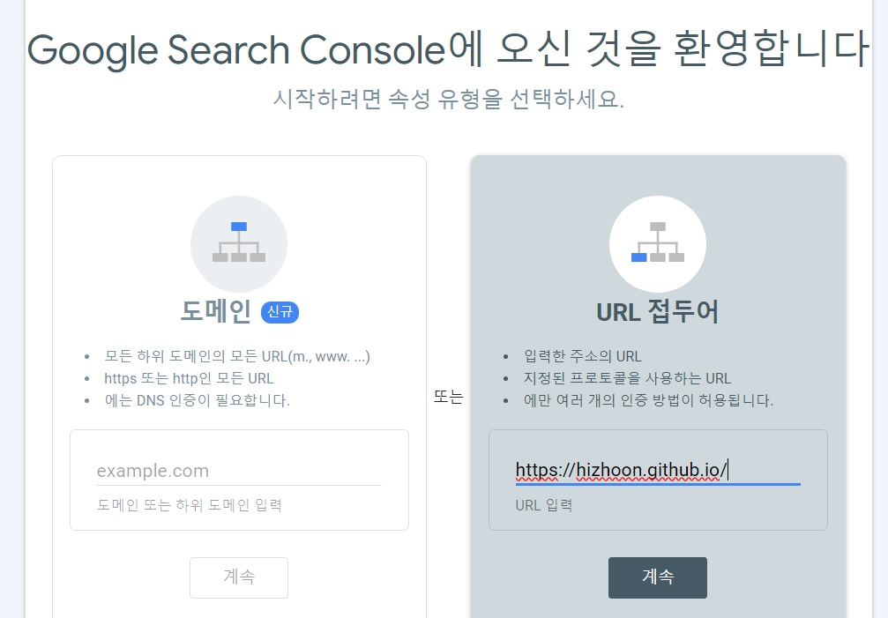
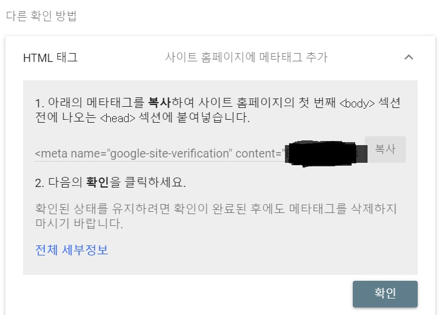

안녕하세요. 지훈입니다.
오늘은 깃허브 블로그 시작하기 5편입니다.

## Step 8. robots.txt 파일 작성하기
오늘은 네이버와 구글에서 블로그가 검색되도록 만들 겁니다! 그러기 위해서는 "**robots.txt**" 파일과 "**sitemap.xml**" 파일이 레포지토리 안에 위치해 있어야 합니다. GitHub 블로그는 GitHub Pages를 이용해 배포하기 때문에, 자동으로 sitemap.xml을 생성해 줍니다. 우리가 따로 만들 필요가 없는 거죠. 그래서 이번 시간에, 우리는 robots.txt 파일만 만들어 보도록 하겠습니다. 

#### 1단계 ) "[네이버 서치어드바이저](https://searchadvisor.naver.com/)" 검색하기

#### 2단계 ) 네이버 로그인 하기 


#### 3단계 ) 오른쪽 상단의 "웹마스터 도구"로 들어가기



#### 4단계 ) 블로그 주소 입력 후, 오른쪽 화살표 버튼 누르기



#### 5단계 ) 'HTML 태그' 선택 후, 아래 메타 태그 복사하기
메타 태그를 복사한 후, `<head>`섹션에 붙여넣기를 해야 합니다. "소유확인 버튼" 을 아직 누르지 마세요!!



#### 6단계 ) `<head>` 섹션에 메타 태그 붙여넣기
깃허브 블로그 코드로 가보면, "**_layouts**" 파일 안에 "**default.html**" 파일이 있습니다. <br>`` 라는 코드 윗 부분에 붙여 넣기를 한 후, commit하면 됩니다. 그 후, 깃허브 블로그가 업데이트가 되어야 하므로 30초 정도 쉬어줄게요. 어느 정도 시간이 됐다싶으면, 다시 네이버 서치어드바이저로 돌아가 "**소유확인**"을 눌러주세요.



등록이 제대로 된 것을 확인할 수 있습니다.

#### 7단계 ) robots.txt 파일 작성하러 가기
등록된 사이트를 보여주는 페이지의 상단의 네비게이션 바를 보면, 지금 "**사이트 관리**" 페이지에 있다는 것을 알 수 있습니다. 옆에 "**간단체크**"를 눌러주세요.



블로그 주소를 작성한 후, 검색해보면 robots.txt 파일이 존재하지 않다고 뜰 겁니다.

> 저는 이미 파일을 작성한 상태라 체크 표시지만, 처음은 빨간 엑스자가 뜨는 게 맞습니다.

그럼, 다시 "**사이트 관리**"로 돌아와서 등록된 자신의 블로그 주소를 눌러주세요.





"**검증**"을 누른 후, "**robots.txt**"로 들어갑니다. 아래로 스크롤을 내려보면, 두번째 사진과 같이 robots.txt를 간단하게 생성하는 툴이 있습니다.<br>저는 되도록 많은 사이트에 노출되기를 원하므로, '**모든 검색 로봇**', '**수집 허용**'을 한 후, **다운로드**를 했습니다.

#### 8단계 ) 깃허브에 파일 추가하기
다시 깃허브로 돌아와 볼게요. robots.txt 파일은 다른 파일 안에 있으면 안되고, index.html처럼 가장 바깥에 있어야 합니다. 



다른 파일 안에 들어와 있는 경우, 사진처럼 왼쪽 상단의 '```내아이디.github.io```'를 누르면 가장 바깥으로 나올 수 있습니다. 가장 바깥으로 나오면, 이미지 파일 업로드 하듯 robots.txt를 업로드 해주면 됩니다.<br>내일 네이버에 검색해보면, 블로그가 네이버에 뜨는 것을 확인할 수 있을 겁니다!

## Step 9. 구글에도 블로그 등록하기
#### 1단계 ) "[구글 서치 콘솔](https://search.google.com/search-console/about?hl=ko)" 검색하기



#### 2단계 ) "시작하기" 누르기
"**시작하기**" 버튼을 누르면, 사진과 같이 뜰 겁니다. 오른쪽을 선택한 후, 블로그 주소를 복사 + 붙여넣기 하면 됩니다.



#### 3단계 ) 메타태그 추가하기
네이버에서 했던 것처럼 메타태그를 복사해, 네이버 메타태그 바로 아래에 붙여넣기합니다. 그럼, 구글에도 등록 끄 - 읕!!

다음에는, 구글 애드센스 신청하는 방법에 대해 포스팅하도록 하겠습니다.
