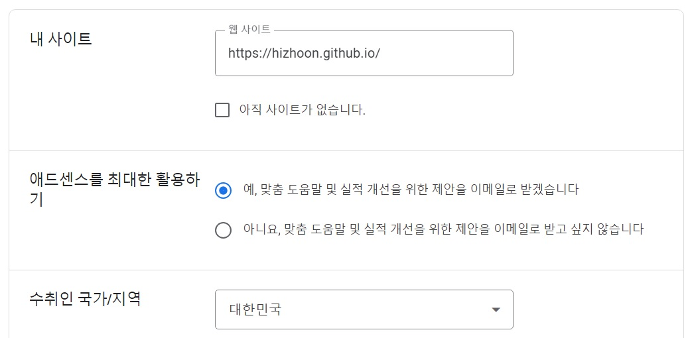
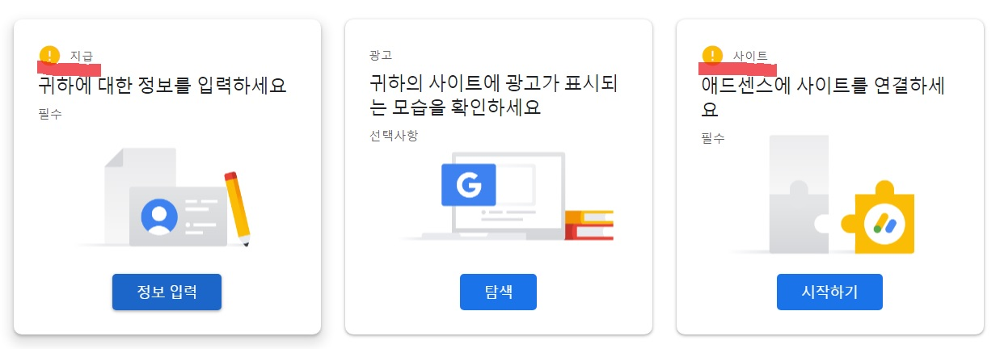
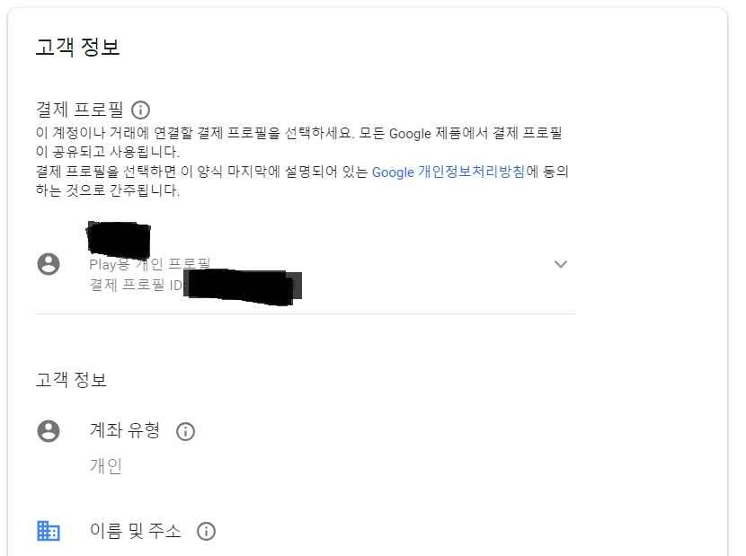
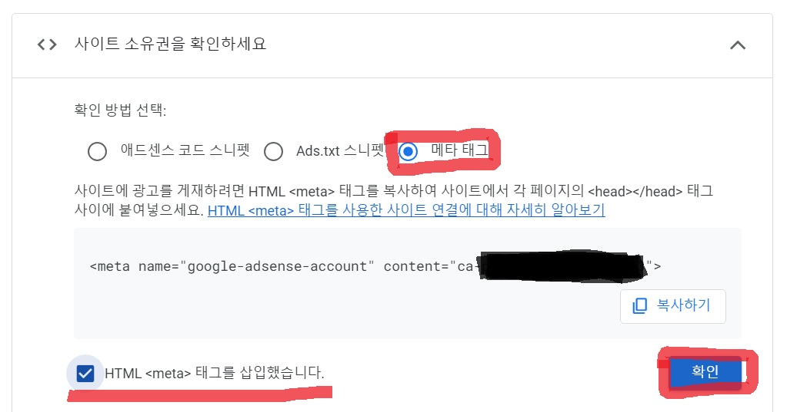
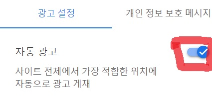
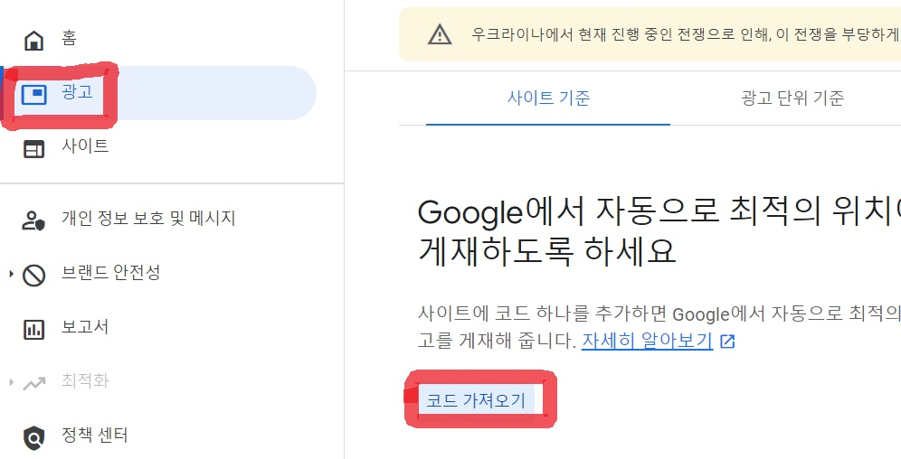

 안녕하세요. 지훈입니다.
오늘은 깃허브 블로그 시작하기 6편입니다.

# 구글 애드센스 신청하기

## Step10. 구글 애드센스 신청하기
아마 가장 궁금했던 부분이 이 부분이 아닐까 싶습니다. 오늘은 구글 애드센스를 신청할 계획입니다.

#### 1단계 ) [구글 애드센스](https://adsense.google.com/start/) 검색하기

#### 2단계 ) 애드센스 시작하기
블로그 주소를 복사 + 붙여넣기 해주세요. 애드센스 승인과 관련된 정보를 즉각적으로 받을 수 있게끔, 이메일 수신 승인을 하는 게 좋을 것 같습니다. 수취인은 "**대한민국**" ! 이용약관은 수락해 주셔야 합니다.

#### 3단계 ) 개인 정보 작성하기
사진을 보면, "지급" 과 "사이트" 두 부분에만 노란색 느낌표만 떠 있습니다. 먼저, **지급**에 들어가 자신의 개인정보를 작성해 주세요.

#### 4단계 ) 메타 태그 추가하기
네이버 서치어드바이저와 구글 서치 콘솔에서도 메타 태그를 추가해서 소유권 확인을 했었던 것 기억하시나요? 구글 애드센스에서도 똑같이 메타 태그를 추가해서 소유권 확인을 할게요. "**사이트**"에 들어가 메타 태그에 체크한 후, 복사해서 **default.html** 파일에서 네이버 메타태그와 구글 메타태그 아래에 붙여넣기를 합니다. 커밋한 후, "**확인**"을 눌러 줍니다. 그 후, **검토요청**을 눌러줍니다.

#### 5단계 ) 광고 설정하기
"지급"과 "사이트" 사이의 "**광고**" 에 들어가 **자동광고**를 켜줍니다. 그 후, "**사이트에 적용**"을 누릅니다.

#### 6단계 ) 광고 코드 추가하기
왼쪽 **광고**를 누른 후, **코드 가져오기**를 누르면, 자동광고 코드가 나옵니다. 그럼 복사해서 아까 **default.html**에 추가한 구글 애드센스 메타태그 바로 아래에 붙여 넣어 줍니다. 자, 이렇게 하면, 애드센스 신청 끄 - 읕 ! 일단, 자동광고로 해놓고 애드센스 승인을 받은 후에 위치조정을 하도록 하겠습니다.

이렇게 일단, 깃허브 블로그에 대한 포스팅은 끝마칠 것 같습니다. 다음 포스팅은 코딩공부에 도움이 될 만한 정보를 가지고 오도록 하겠습니다!
