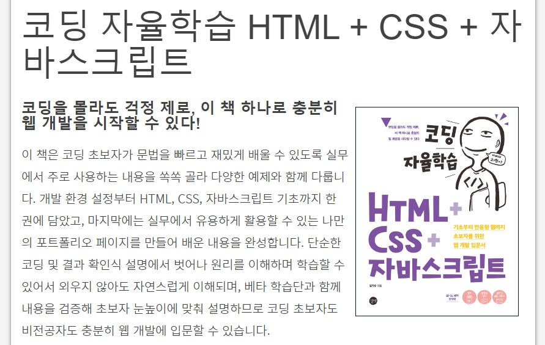
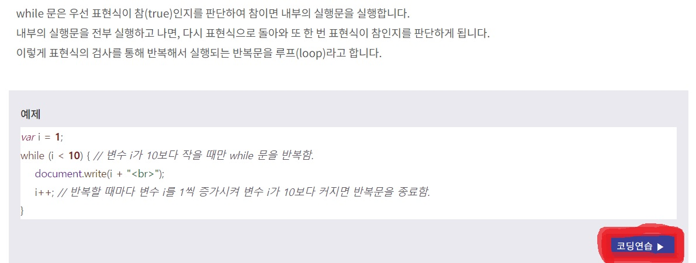

Hello, I'm Jihoon. Today, I'm going to tell you how non-majors can learn coding quickly.

## Why We Should Study Coding
First, let me tell you why even non-majors should study coding.

### 1. Fast-growing digital environments
Our society is now an information society. Furthermore, the growth rate is also very fast. I remember that smartphones came out around 2011. It's been about 10 years, so it hasn't been that long. However, now it is a world where you can talk to artificial intelligence beyond smartphones.

I'm sure you've used ChatGPT. With ChatGPT, you can speed up your work and increase your efficiency faster. It really influenced our lives a lot. In addition, we could start a startup using ChatGPT, provide ideas to ChatGPT, and create new games or apps after receiving codes. As such, it has become a world where non-majors can make simple games without writing a single code.

The reason I said this is not "Well, then, I don't have to study coding?" It's because I think it's better to learn coding more easily and quickly, and to understand coding to be able to adapt quickly in the digital world.

### 2. Automation and efficiency
I just showed you an example of ChatGPT. You can also increase efficiency by using ChatGPT to get clues to solving problems, but you can also use automation codes to increase work efficiency.

I think a lot of people who use Excel will know. You can automate Excel tasks using Python code. You can use "Selenium" to automate crawling, or you can use ChatGPT to automate Excel tasks. If you know how to code like this, you can spend less time and do more work than others!

### 3. Expanding job opportunities
Just because I know how to code, there is a wider range of jobs I can choose. Some people think coding is necessary only in the IT industry, but it's actually different. Coding capabilities are highly valued not only in the IT industry, but also in finance, healthcare, and marketing. Therefore, I think that learning coding will help you more when you get a job.

## What order should I study coding?
When I first started studying coding, I had so many worries. When I started, there were so many computer languages. I didn't really know what it was helpful to learn first, or if there was a set sequence. So I tried to search for internet, but it didn't help. So I would like to introduce you to the study method that I did.

### I. Choosing the language to study according to the purpose

There may be some people who want to study simply thinking that it would be better to learn coding. I think it's better for these people to study Python first. I think Python's code is intuitive, and grammar is easier than other languages. There are many things you can do with Python, so I think knowing Python will help you a lot.

There are some people who want to create an app by themselves. I was in this very case. I wanted to create an app that could be applied to both Android and ios, so I learned Java first. After that, I tried to learn swift, but I was busy along the way, so I only studied Java. If you want to make only Android apps, I recommend Java or Kotlin, and if you want to make only ios apps, I recommend Swift. If you want to make both, just study either react-native or flutter to create a hybrid app. If you do it alone, hybrid apps are much more economical.

If you want to create a web page by yourself, you can study JavaScript, html, and css. There are many other things, but you can create a webpage with just the basics, so you only need to know these three for the first time.

### II. Studying Basic Grammar
If you've decided on a language, Just study basic grammar for now. I will recommend sites that are helpful for studying. You may want to buy a book or take an online course, but the sites below are also very good for learning basic grammar for the first time.

#### 1. [더 북 (The Book)](https://thebook.io/)
"The Book" is an IT book reading service provided by Book Publishing Gilbott Company. If you go in, there are e-books about the web, apps, hacking, games, and so on. There are some books that can only be read, but most of them are available, and it is a site that collects only really high-quality e-books.  If you're self-taught, you can use this e-book.

I also studied the web using this book in The Book. I didn't look at it from start to finish, but I studied only basic grammar.

#### 2. [위키독스 (Wiki Docs)](https://wikidocs.net/)
Wikidocs is a platform service that produces and shares online books. If you go in, there are so many e-books. There are a few jump-to-series as well, so you'll find it useful.

I also studied Python using "Jump to Python" on this site. Not only is it well explained, but it also has a comment function, so if you leave a question, you can get an answer, so I think it will be very helpful for those who are studying for the first time.

###  III. Writing the actual code to get the results
I think this is the most important thing. I think I can never get used to coding if I just study grammar, read a book or listen to a lecture continuously. You have to fix the code while actually squeezing the code with your hands and checking the results to get used to it faster and better understanding.

Then, I'm going to try out the actual code, but I'm not really coding it, I'm studying it, so downloading various languages and tools to my computer can be burdensome. Also, There are probably people who don't have a computer yet. For those people, I will teach you how to code using the Internet regardless of location and time. It only needs to be connected to the Internet, so you can use it anywhere on your phone, tablet, or PC room.

#### 1. [코딩의 시작, TCP School](https://tcpschool.com/)
TCP School is a webpage where you can learn coding. If you go in, you can teach yourself by looking at documents as well as online lectures.

Most importantly, you can learn like the picture above and use the code editor to write your own code and get the results. Tap "Coding Practice" at the bottom right of the picture, and you'll find a code editor where you can squeeze the code and get the results. I think this is the most efficient way to learn basic grammar. This site also allows you to study various fields, so it would be nice to go and look around.

#### 2. [구름IDE (groomide)](https://www.goorm.io/)
Groom is a cloud software ecosystem where anyone can learn to code, evaluate their skills, and develop software using cloud technology. As long as you sign up, you can code at your disposal. The 'swift' that makes the ios app requires a MacBook, but with GroomIDE, you can make the ios app with your phone, Galaxy, or LG laptop.

GroomIDE has some charge plans. However, you can use many functions for free, so it would be good to try it for free. I am also a free subscriber, but I think it's enough to use it alone. If you look at the picture above, I actually made a website using GroomIDE, and it was very convenient to be able to do git commit here. It's available in many languages, so I recommend you learn basic grammar, code here, and give your own feedback as you get the results!

## Conclusion
You can learn coding in a short period of time by repeating the process of writing code in a simple project format, seeing the results, and giving feedback again after taking out the basic grammar in this way. Practice is always important. Just hanging on to books doesn't mean it works. I hope everyone has good results. I think the following will be a post about my coding studies.
