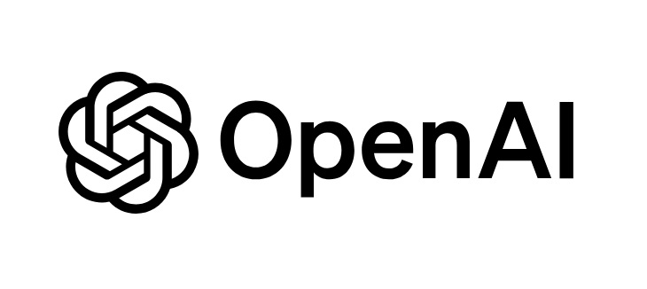
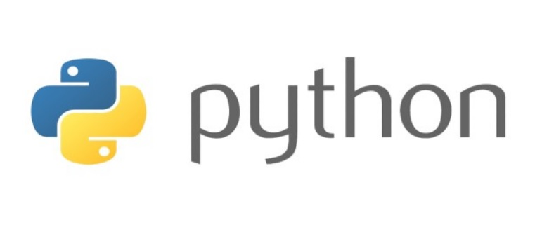
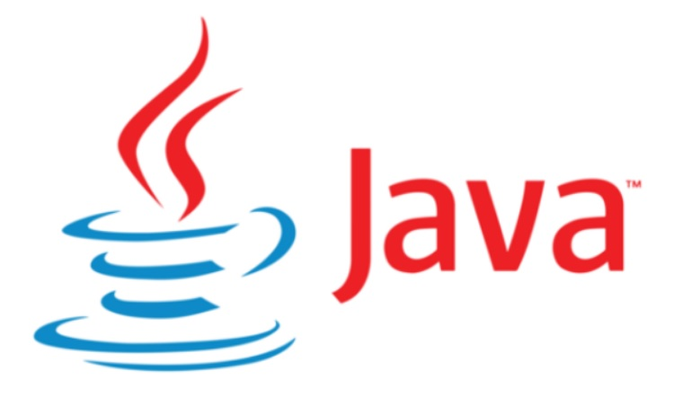
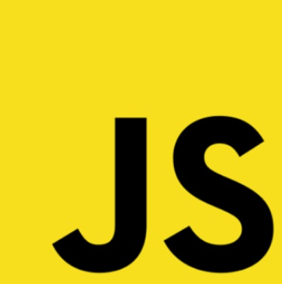
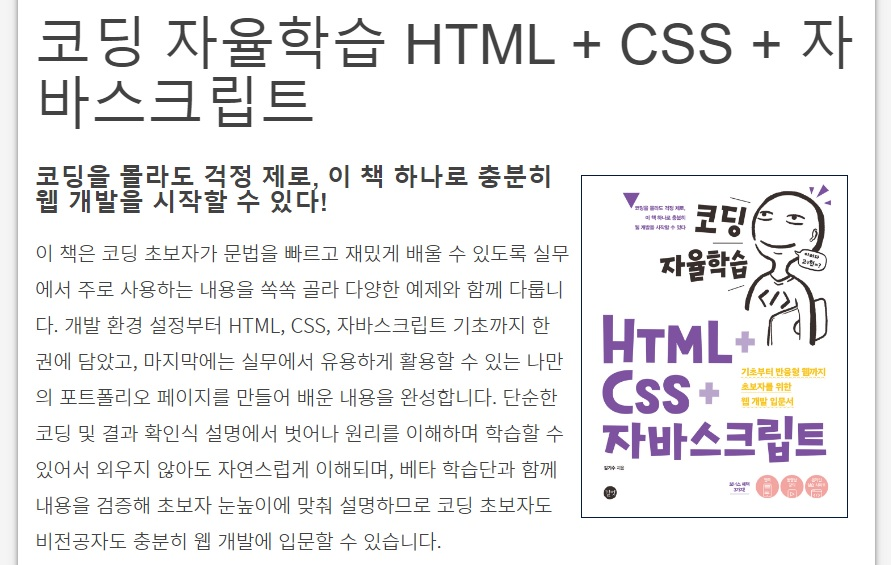
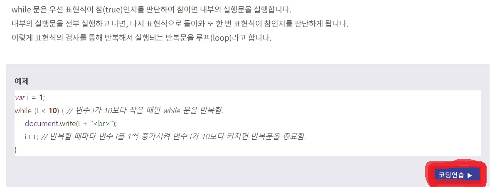
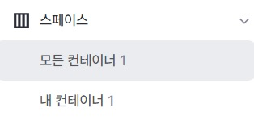

안녕하세요. 지훈입니다. 오늘은 비전공자가 코딩을 빨리 익힐 수 있는 방법에 대해 알려드리겠습니다.

## 코딩을 공부해야 하는 이유
먼저, 왜 비전공자도 코딩을 공부해야 하는지를 알려 드리겠습니다.

### 1. 빠르게 성장하는 디지털 환경
지금 우리 사회는 정보화 사회입니다. 더군다나 성장 속도도 매우 빠르죠. 스마트폰이 2011년 쯤 나온 걸로 기억합니다. 약 10년 더 지났으니 그렇게 오랜 시간이 지나지는 않았습니다. 그런데, 지금은 스마트폰을 넘어 인공지능과 대화할 수 있는 세상이 되었습니다.

여러분도 챗지피티를 이용해 보셨을 거라 생각합니다. 챗지피틀 이용해, 일의 속도와 효율을 더 빠르게 높일 수 있죠. 정말 우리 생활에 많은 영향을 끼쳤습니다. 또한, 챗지피티를 활용해 스타트업을 창업하거나 챗지피티에게 아이디어를 제공하고 코드를 받은 후 새로운 게임이나 앱을 만들 수도 있었고요. 이처럼 비전공자도 코드 하나 짜지 않고 간단한 게임을 만들 수 있는 세상이 되었습니다.

제가 이 말을 한 이유는 그럼, 코딩공부를 안 해도 되겠네? 가 아니라 좀 더 쉽고 빠르게 코딩을 익힐 수 있게 되었고, 디지털 세상에서 빠르게 적응할 수 있기 위해서는 코딩을 어느 정도 알아 두는 게 좋지 않나 싶어서 입니다.

### 2. 자동화 및 효율성
제가 방금 챗지피티 예시를 들었죠. 챗지피티를 이용해 문제 해결의 단서를 얻는 방식으로 효율성을 높일 수도 있지만, 자동화코드를 이용해서도 업무 효율성을 높일 수 있습니다.

엑셀을 이용하시는 분들은 많이 아실 거라 생각합니다. 파이썬 코드를 이용해 엑셀 업무 자동화를 할 수 있습니다. "셀레니움"을 이용해 크롤링을 자동화 할 수도 있고, 챗지피티를 결합해 자동화 할 수도 있습니다. 이처럼 코딩을 할 줄 안다면, 다른 사람들보다 더 적은 시간을 들여 더 많은 일을 할 수 있겠죠!

### 3. 직업 기회 확장
코딩을 할 줄 안다는 이유만으로 내가 고를 수 있는 직업의 폭이 넓어집니다. IT 산업에서만 코딩이 필요하다 생각하시는 분들도 있지만 사실은 다릅니다. IT 산업 뿐만 아니라 금융, 의료, 마케팅 등 여러 분야에서도 코딩 능력을 매우 가치있게 여깁니다. 따라서, 코딩을 배우면, 취업할 때 더 도움이 되리라 생각합니다.

## 	어떤 순서로 코딩을 공부하는 게 좋을까?
저도 처음 코딩 공부를 시작하려 할 때, 고민이 너무 많았습니다. 시작하려고 보니, 컴퓨터 언어들이 정말 많더라고요. 뭐부터 배우는 게 도움이 되는지, 정해진 일련의 순서가 있는지 정말 하나도 아는 게 없었습니다. 그래서 열심히 지식인에도 찾아보고 했지만, 도움이 되지는 않았습니다. 그래서 제가 했던 공부 방법을 소개해 드리려 합니다.

### I 목적에 따라 공부할 언어  정하기

**그냥 단순히 코딩을 배워 놓는 게 좋지 않을까 싶어서 공부하려는 분들**도 계실 겁니다. 이 분들은 **파이썬부터** 공부하는 게 좋을 것 같습니다. 파이썬이 코드가 직관적이기도 하고, 문법이 다른 언어에 비해 쉽다고 생각합니다. 파이썬은 할 수 있는 일도 많기 때문에 파이썬만 알아도 많은 도움이 될 거라 생각합니다.

나 혼자 앱을 만들고 싶으신 분들도 계실 겁니다. 제가 바로 이 경우에 속했습니다. 저는 안드로이드, ios 모두 적용 가능한 앱을 만들고 싶어서 자바를 먼저 배웠습니다. 그 후에, swift를 배울려 했는데, 도중에 바빠 자바만 공부하고 끝났습니다. **안드로이드 앱**만 만들고 싶으신 분은 **자바** 또는 **코틀린**을, **ios앱**만 만들고 싶으신 분은 **swift**를 추천드립니다. 둘 다 만들고 싶으신 분은 그냥 **react-native**나 **flutter** 둘 중 하나 공부해서 **하이브리드 앱**을 만드세요. 혼자 한다면, 하이브리드 앱이 훨씬 경제적입니다.

나 혼자 웹페이지를 만들고 싶으신 분들은 **자바스크립트,html,css**를 공부하면 됩니다. 여러 다른 것들도 있는데 기본만 가지고도 웹페이지를 만들 수 있으니 처음은 이 세 개만 알면 됩니다.

### II 기본 문법 공부하기
언어를 정했다면, 기본 문법부터 공부하면 됩니다. 진짜 딱 기본! 인 문법만 일단 공부하세요. 공부할 때 도움이 되는 사이트들을 추천해 드리겠습니다. 책을 사거나 인강을 들어도 좋겠지만, 아래 사이트들도 처음 기본 문법을 터득하기에는 매우 좋습니다.

#### 1. [더 북 (The Book)](https://thebook.io/)
"더 북" 은 (주)도서출판 길벗에서 제공하는 IT 도서 열람 서비스입니다. 들어가 보면, 웹, 앱, 해킹, 게임 등 정말 여러 가지 분야에 관한 전자책들이 있습니다. 일부만 열람가능한 책도 있으나, 대부분의 책이 모두 열람 가능하며, 정말 양질의 전자책들만 모아 놓은 사이트입니다.  독학하시는 분들은 여기 전자책을 이용하셔도 좋을 것 같습니다.

저 또한, 더북에서 이 책을 이용해 웹 공부를 했습니다. 처음부터 끝까지 보지는 않았고, 딱 기초문법들만 골라 공부했습니다.

#### 2. [위키독스 (Wiki Docs)](https://wikidocs.net/)
위키독스는 온라인 책을 제작 공유하는 플랫폼 서비스입니다. 들어가 보면, 정말 많은 전자책들이 있습니다. 점프 투 시리즈들도 몇 편 있으니 유용하게 이용할 수 있을 겁니다.

저 또한 이 사이트에서 "점프 투 파이썬" 을 이용해 파이썬을 공부하였습니다. 설명도 잘 되어 있을 뿐만 아니라, 댓글 기능이 있어, 질문을 남기면, 답변을 얻을 수도 있어 처음 공부하시는 분들에게는 매우 도움이 될 것이라 생각합니다.

### III 실제 코드 작성해서 결과물 얻기
저는 이것이 가장 중요하다고 생각합니다. 책을 읽거나 강의를 들으면서 문법을 파고 파고 또 판다해서 절대 코딩에 익숙해 질 수 없다 생각합니다. 실제 내 손으로 코드를 짜보고 결과물을 확인하면서 코드를 고쳐나가야 손에 더 빠르게 익고 이해도가 높아집니다.

그럼, 실제 코드를 짜볼 건데, 아직은 본격적으로 코딩하는 단계가 아니라 공부하는 단계이므로 여러 언어들과 도구를 컴퓨터에 다운받는 게 부담스러울 수 있습니다. 아직 컴퓨터가 없으신 분들도 있을 거고요. 그런 분들을 위해 장소 시간 상관없이 인터넷을 이용해 코딩을 하는 방법을 알려 드리겠습니다. 인터넷 연결만 되면 되므로 핸드폰, 태블릿, pc방 어디에서든 가능합니다.

#### 1. [코딩의 시작, TCP School](https://tcpschool.com/)
TCP School 은 코딩을 배울 수 있는 웹페이지입니다. 들어가 보면, 인강 뿐만 아니라, 문서들을 보면서 독학을 할 수 있게 되어 있습니다.

가장 중요한 점은 위의 사진 처럼 배우면서 바로바로 코드 에디터를 이용해 직접 코드를 짜보고 결과를 받을 수 있다는 점입니다. 사진의 오른쪽 하단의 "코딩연습"을 누르면, 코드를 짜고 결과를 받을 수 있는 코드 에디터가 나옵니다. 기초 문법을 배우는 데에는 이만큼 효과적인 곳은 없다고 생각합니다. 이 사이트도 여러 분야들을 공부할 수 있게 되어있으니 가서 둘러보시면 좋을 것 같습니다.

#### 2. [구름IDE (groomide)](https://www.goorm.io/)
구름은 클라우드 기술을 이용하여 누구나 코딩을 배우고, 실력을 평가하고, 소프트웨어를 개발할 수 있는 클라우드 소프트웨어 생태계입니다. 가입만 하면, 내 마음대로 코딩을 할 수 있습니다. ios앱을 만드는 'swift'는 맥북이 필요한데, 구름IDE를 이용하면, 핸드폰, 갤럭시나 LG노트북을 가지고도 ios앱을 만들 수 있습니다.

구름IDE는 요금제가 있습니다. 하지만 무료로도 많은 기능을 이용할 수 있으므로, 무료로 일단 이용해 보시는 것도 좋을 것 같습니다. 저 또한, 무료 가입자이지만 혼자 쓰기에는 충분하다 생각합니다. 위 사진을 보면, 실제 저도 구름IDE를 이용해 웹사이트 제작을 했었는데 깃 커밋도 여기서 할 수 있어서 매우 편리했습니다. 여러 언어를 이용할 수 있으니 기본 문법을 배우면서 여기서 코드를 짜고 결과를 받으면서 스스로 피드백을 해보는 걸 추천드려요!

## 마무리
이런 식으로 기본 문법을 뗀 후, 간단한 프로젝트 형식으로 코드를 짜고, 결과물을 보고, 다시 피드백하는 과정을 반복해 나가다 보면 단기간에 코딩을 익힐 수 있습니다. 실천이 언제나 중요하죠. 책에만 매달린다고 해서 되는 게 아닙니다. 모두들 좋은 결과가 있길 바라겠습니다. 다음은 제 코딩 공부에 관한 포스팅이 될 것 같습니다.
