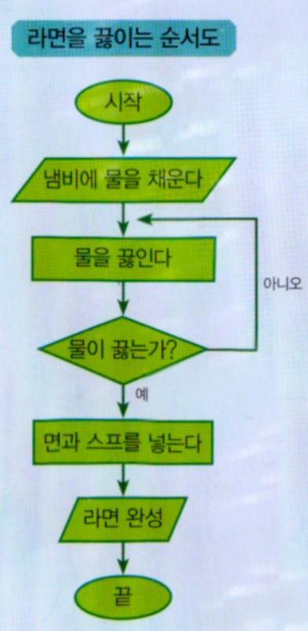

Hello, I'm Jihoon.<br>Today, I will summarize why we need to learn algorithms and data structures and simple concepts.

## The Importance of Algorithms and Data Structures
### 1. It is important to understand algorithms and data structures in solving problems
Algorithms define how to solve a given problem, and data structures provide a way to store and manipulate data. You need to know both of them so that if you have a problem with the code, you can fix it more efficiently. By selecting effective algorithms and using the appropriate data structure, you can optimize the program's execution speed and memory usage.

Even if you code the same situation, there are people who write more efficient codes. It can be seen that these people have a clearer understanding of algorithms and data structures.

### 2. Improved programming efficiency
Using good algorithms and data structures can greatly improve the efficiency of the program. For example, implementing search algorithms effectively allows you to quickly find the information you want from large amounts of data. In addition, selecting the right data structure will help you store and manage your data efficiently.

### 3. Required for System Design
Algorithms and data structures are also essential when designing large systems. In a variety of systems, such as databases, network systems, and operating systems, efficient data structures and algorithms greatly influence the performance of the system.



I brought a flowchart of boiling ramen that shows the algorithm easily. If you look at the picture, it's very efficient in cooking ramen, right? As such, efficient algorithms bring delicious ramen.

## Algorithms
**Algorithms** refers to a set of step-by-step procedures or rules for solving a problem, meaning a clear and effective way to obtain the desired output for a given input.

### What is a good algorithm?
The better the algorithm, the better the code. So, let me introduce what is a good algorithm and three things that a good algorithm should have.

 - **Efficiency** : A good algorithm should be able to produce the desired results in a certain amount of time, regardless of the size of the input data.
 - **Legibility**: Algorithms must be easy to understand and readable when implemented in code.
 - **Accuracy**: Algorithms must produce accurate results and produce consistent output for input values.

### Algorithm Type
The algorithm you apply depends on the situation. You have to think about which algorithms will be effective and then choose carefully.
 - **Exploration algorithms and data structure** : In search problems, algorithms that perform efficient search by utilizing various data structures such as arrays, trees, and graphs are important.
 - **Alignment algorithms and data structure** : Alignment problems require algorithms to sort data using data structures such as arrays.
 - **Graph Algorithm and Data Structure** : In graph problems, the data structure and graph navigation algorithms that represent the graph are important.
 
## Data Structure
 **Data structure** refers to a method or structure for efficiently storing and manipulating data. In other words, it provides a framework for organizing and managing data. Among the various data structures, arrays, connection lists, stacks, queues, trees, and hash tables are widely used.

### 1. 배열(Array)
A data structure that stores data in a row that allows you to quickly access values at specific locations using indexes.<br>Case to select the array data structure: If the data is fixed in size and requires a quick search through the index.
```
alphabet = ["A", "B", "C", "D"]
print(alphabet[2])
# Output: C
```
### 2. 연결 리스트(Linked List)
Nodes have a connected structure, and insertion and deletion are more efficient than arrays.<br>Case to select the Linked List data structure: Case that the size of the data changes dynamically, and intermediate insertion or deletion is frequent.
```
class  Node:
	def  __init__(self, data):
		self.data = data
		self.next = None 

# Creating a list of links: 1 -> 2 -> 3
head = Node(1)
head.next = Node(2)
head.next.next = Node(3)
```
### 3. 해시 테이블(Hash Table)
It is a data structure that uses a hashing technique that allows you to quickly find values for specific keys, and it is very fast to search.<br>When selecting the hash table data structure: Case that quick search is required, and data is stored in key-value pairs.
```
hash_table = {}
hash_table["a"] = 1
hash_table["b"] = 2
print(hash_table["a"])
# Output: 1
```
### 스택(Stack)
A stack is a data structure with Last-In, First-Out (LIFO) characteristics, and the stack inserts and deletes data from only one end. Case to select the stack data structure: When you call a function, you manage the call stack.
```
stack = []
stack.append(1)
stack.append(2)
stack.pop()
# Output: 2
```
### 큐(Queue)
The queue is a data structure with First-In and First-Out (FIFO) characteristics, and the queue is inserted and deleted at both ends, respectively. When selecting the queue data structure: When managing job queues.
```
from collections import deque
queue = deque()
queue.append(1)
queue.append(2)
queue.popleft()
# Output: 1
```

I haven't decided on the next post yet, but it will come soon.
