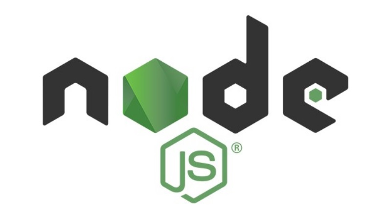

안녕하세요. 지훈입니다.<br>오늘은 "Node.js"에 대해 이야기를 해보려 합니다.

<iframe width="280" height="160" src="https://www.youtube.com/embed/Tt_tKhhhJqY?si=HUtonyK6kAK4_ZIb" title="YouTube video player" frameborder="0" allow="accelerometer; autoplay; clipboard-write; encrypted-media; gyroscope; picture-in-picture; web-share" allowfullscreen></iframe>

유튜브 조코딩 님의 "한 시간 만에 Node.js 백엔드 기초 끝내기(ft. API구축)" 라는 Node.js의 기초 영상을 시청하였습니다. 이를 토대로 제가 오늘 공부한 내용을 정리해보려 합니다.  

## Node.js란?

크롬 브라우저에서 자바스크립트를 실행할 수 있었죠. 자바스크립트는 브라우저에 인터프리터가 있어 로컬에 설치 없이 바로 사용할 수 있었던 겁니다. 그런데 이제, 서버에서 자바스크립트를 작동하게 하려면 Node.js를 설치해야 합니다.<br>즉, Node.js는 자바스크립트로 백엔드 개발이 가능하게 만들어주는 프레임워크입니다.

## npm이란?
"Node Package Manage" 의 약자로, 우리가 하나하나 코드를 짤 필요없이 만들어진 모듈을 가져올 수 있게 하는 재료 모음집이라고 볼 수 있습니다. <br>[npm 사이트](https://www.npmjs.com/)에서 내가 원하는 모듈을 찾을 수 있습니다.

모듈을 다운로드 하기 전에 먼저, 할 일 !
```
npm init
```
터미널에 입력하면, 사용자가 다운로드한 모듈을 정리해서 보여줍니다. "package.json파일"이 만들어지는데, 그 파일에 들어가보면, 내가 다운로드한 모듈이 어떤 모듈인지 간략하게 설명되어 있습니다. 실제 모듈을 설치하고 나면, "package-lock.json파일"도 생성되는데, 이것은 더 자세하게 모듈을 설명해준 파일입니다.

## 모듈 설치하기


영상처럼 figlet 모듈로 예시 정리를 하겠습니다.
```
npm install figlet
```
이런 식으로 다운로드할 모듈 이름을 뒤에 적어서 터미널에 적으면, 다운로드가 됩니다. "package.json파일"에 가보면, 내가 다운로드한 figlet이 작성되어 있음을 알 수 있습니다.

## Express란?
Node.js 기반의 웹 프레임워크를 만드는 것이 Express모듈이라고 합니다. 웹 브라우저에서 클라이언트가 요청한 request를 서버에서 처리 후, 클라이언트로 reponse 응답을 주는 역할을 Express가 합니다.

## Express 사용하기
Express도 npm 모듈이므로 위에서 figlet 모듈을 설치한 것처럼 설치해 주면 됩니다.
```
npm install express
```
npm 사이트에 적혀 있는 예제 코드를 이용해 정리해볼게요.
```javascript
// index.js
const express = require('express')
const app = express()
const port = 3000

app.get('/', (req, res) => {
  res.send('Hello World!')
})

app.listen(port, () => {
  console.log(`Example app listening on port ${port}`)
})
```
index.js 파일을 만들어준 후, 그 안에서 실행한 코드입니다.

먼저, require() 함수를 이용해서 express 모듈을 불러와 express 변수에 할당해 줍니다. 그 후, express() 를 app 변수에 할당해 줍니다.

```javascript
const port = 3000

app.listen(port, () => {
  console.log(`Example app listening on port ${port}`)
})
```
3000번 포트에서 listen을 하면 뒤의 console.log() 콜백함수가 실행됩니다. listen은 항상 실행되고 있다고 보시면 돼요. 항상 듣고 있어야, 요청이 왔을 때, 요청을 받을 수 있으니까요.
```javascript
app.get('/', (req, res) => {
  res.send('Hello World!')
})
```
### get
HTTP 메서드. 클라이언트에서 서버로 요청을 보낼 때 사용하는 방식이며 get, post 등의 다양한 메서드가 존재합니다.
### ' / ' (라우팅)
port로 들어오는 다양한 api 경로를 의미합니다. ' / ' 이런식으로 짝대기 하나만 있는 것을 루트(root)라고 합니다.
### (req, res) => { res.send('Hello World!') } (콜백함수)
port로 들어오는 경로를 받으면, 바로 실행되는 콜백함수입니다. 응답으로, 'Hello World!' 를 보냈네요. 브라우저에서 localhost:3000 으로 접속하면, 'Hello World!' 가 나오는 것을 확인할 수 있습니다.
## param 으로 변수 보내기
```javascript
app.get('/user/:id', (req, res) => {
    const param = req.params
    console.log(param)
    console.log(param.id)

    res.json({'animal': param.id})
})
```
'/user/:id' 이런 식으로 ':id'를 하면, 라우팅에 변수를 설정할 수 있습니다. param 변수에서 req.params를 받은 후, param.id를 하면, id값을 꺼낼 수 있습니다. 그 후, json형식으로 response에 보내줬습니다.
```
# 브라우저 주소
http://localhost:3000/user/cat

# 결과
{"animal":"cat"}
```
이런 식으로, id값으로 cat을 주면, id값을 받아와 화면에 cat이 나오게 됩니다.
```javascript
 const { id } = req.params
```
이런 식으로, 중괄호로 묶어 변수를 나타내면, 코드 두 줄을 거치지 않고, 변수 id에 바로 req의 id값을 줄 수 있습니다.
## CORS 이슈
HTML파일에서 node.js 또는 다른 서버에 request를 요청을 보냈을 때 서버에서는 이상한 곳 또는 위험한 요청이 올 수 있기 때문에 기본적으로 요청을 막게 되어 있습니다. 그래서 HTML로 요청을 할 때 CORS 설정이 없으면 차단이 되어 오류가 뜨게 됩니다. 하지만, 우리는 html로도 요청을 할 수 있어야 하겠죠? 그래서 cors 연결을 알아야 합니다.

## CORS 연결하기
cors도 npm 모듈이므로 설치하고 시작할게요.
```
npm install cors
```
```javascript
const express = require('express')
const cors = require('cors')
const app = express()
const port = 3000

app.use(cors())
```
require함수를 이용해 cors변수에 cors 모듈을 할당해줍니다. 그 후, app.use(cors()) 를 하면, cors연결을 해결할 수 있습니다.
### HTML 화면 구현
```html
<!DOCTYPE html>
<html lang="en">
<head>
    <meta charset="UTF-8">
    <meta http-equiv="X-UA-Compatible" content="IE=edge">
    <meta name="viewport" content="width=device-width, initial-scale=1.0">
    <title>cors 이슈 해결</title>
</head>
<body>
    <input type="text" id="name">
    <button onclick="getSound()">API 요청</button>
    <script>
        function getSound() {
            const name = document.getElementById('name').value
            fetch(`http://localhost:3000/sound/${name}`)
            .then(response => response.json())
            .then(data => {
                console.log(data)
                document.getElementById('name').value = data
            })
        }
    </script>
</body>
</html>
```
이렇게, html에서 서버로 요청을 보내도, 결과가 잘 나옴을 확인할 수 있습니다.

원래 되는 거 아니야? 싶으신 분들은 cors부분을 지운 후에 캐시도 지운 후 다시 실행해 보세요. 오류가 뜨는 것을 확인할 수 있습니다.

강의의 모든 부분을 요약한 건 아니고 제가 듣고 떠올릴 수 있도록 몇 부분만 가져왔습니다. 저는 전공자도 아니며 그냥 재밌어서 공부하는 사람일 뿐입니다. 사용한 언어에 있어서 틀린 부분이 있을 수 있음을 유념해주세요. 다음에는 새로운 공부거리를 포스팅하도록 하겠습니다.
