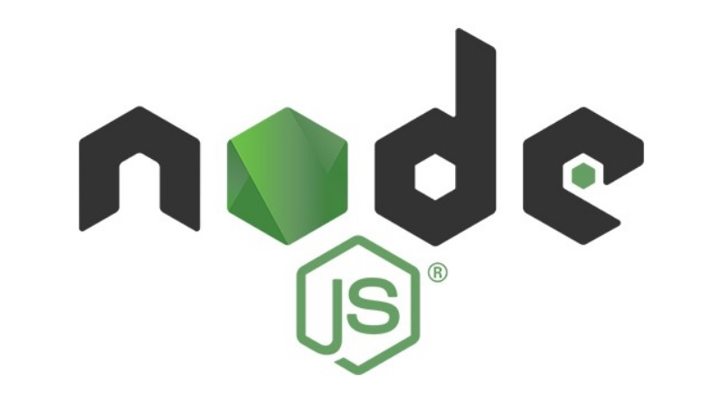
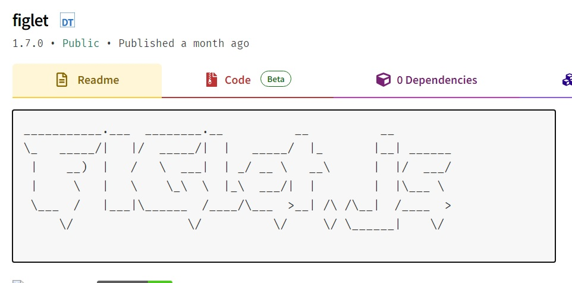

Hello, I'm Jihoon.<br>Today, I'm going to talk about "Node.js."

<iframe width="280" height="160" src="https://www.youtube.com/embed/Tt_tKhhhJqY?si=HUtonyK6kAK4_ZIb" title="YouTube video player" frameborder="0" allow="accelerometer; autoplay; clipboard-write; encrypted-media; gyroscope; picture-in-picture; web-share" allowfullscreen></iframe>

I watched a basic video of Node.js called "End Node.js Backend Foundation (ft. API Construction) in an hour" by YouTube Jo Coding. Based on this, I would like to summarize what I studied today.

## What is "Node.js"?

We are able to run JavaScript on Chrome browser. JavaScript has an interpreter in the browser, so you can use it right away without installing it locally. Now, you need to install Node.js to make JavaScript work on the server.<br>In other words, Node.js is a framework that enables backend development in JavaScript.
## What is "npm"?
Abbreviated as "Node Package Manage," it's a collection of materials that allows us to import modules that are created without having to code one by one. <br>You can find the module you want on the [npm site](https://www.npmjs.com/).

Before downloading the module, first, what to do!
```
npm init
```
When you type in the terminal, it summarizes the modules downloaded by the user. The "package.json file" is created, and when you go into it, it briefly describes which module I downloaded. After installing the actual module, the "package-lock.json file" is also created, which explains the module in more detail.

## Installing a Module


Like the video, I'll organize the examples with the figlet module.
```
npm install figlet
```
If you write down the name of the module you want to download in this way and write it down in the terminal, it will be downloaded. If you go to the "package.json file", you can see that the figlet I downloaded is written.
## What is "Express"?
It is called the Express Module that creates a web framework based on Node.js. Express is responsible for providing a response to the client after the server processes the request requested by the client in the web browser.

## Using Express
Express is also an npm module, so you can install it as if you installed the figlet module above.
```
npm install express
```
I'll organize it using the example code written on the npm site.
```javascript
// index.js
const express = require('express')
const app = express()
const port = 3000

app.get('/', (req, res) => {
  res.send('Hello World!')
})

app.listen(port, () => {
  console.log(`Example app listening on port ${port}`)
})
```

First, use the require() function to load the express module and assign it to the express variable. Then assign express() to the app variable.

```javascript
const port = 3000

app.listen(port, () => {
  console.log(`Example app listening on port ${port}`)
})
```
When port 3000 on the server listens, the subsequent console.log() callback function is executed. Listen is always running. Port has to be listening all the time, so that when a request comes, port can get it.
```javascript
app.get('/', (req, res) => {
  res.send('Hello World!')
})
```
### get
HTTP method, which is used to send requests from a client to a server, and there are various methods such as get, post, etc.
### ' / ' (Routing)
Means the various api paths that come into the port. ' / ' This way, having only one mate is called a root.
### (req, res) => { res.send('Hello World!') } (Callback function)
A callback function that runs as soon as it receives a path to the port. As a response, they sent "Hello World!" If you access localhost:3000 in your browser, you will see 'Hello World!'
## Sending variables using param
```javascript
app.get('/user/:id', (req, res) => {
    const param = req.params
    console.log(param)
    console.log(param.id)

    res.json({'animal': param.id})
})
```
'/user/:id' By doing ':id' in this way, you can set variables for routing. After receiving the req.params from the parameter variable, you can take out the id value by doing param.id . After that, I sent it to response in json format.
```
# Browser Address
http://localhost:3000/user/cat

# Result
{"animal":"cat"}
```
In this way, if you give the cat as the value of the id, you get the value of the id and you get the cat on the screen.
```javascript
 const { id } = req.params
```
In this way, if you represent a variable in brackets, you can give the variable id an id value of req directly without going through two lines of code.
## CORS issue
When you send a request to node.js or another server in an HTML file, the server basically blocks the request because it might get a strange or dangerous request. So, when you make a request with HTML, if there is no CORS setting, it will be blocked and an error will appear. However, we should be able to make a request in html, right? That's why you need to know the cors connection.
## Connecting CORS
The cors is also an npm module, so I'll install it and start.
```
npm install cors
```
```javascript
const express = require('express')
const cors = require('cors')
const app = express()
const port = 3000

app.use(cors())
```
Use the require function to assign the cors module to the cors variable. After that, you can solve the cors connection by doing the app.use(cors()).
### HTML Screen Implementation
```html
<!DOCTYPE html>
<html lang="en">
<head>
    <meta charset="UTF-8">
    <meta http-equiv="X-UA-Compatible" content="IE=edge">
    <meta name="viewport" content="width=device-width, initial-scale=1.0">
    <title>cors Issue resolution</title>
</head>
<body>
    <input type="text" id="name">
    <button onclick="getSound()">API Request</button>
    <script>
        function getSound() {
            const name = document.getElementById('name').value
            fetch(`http://localhost:3000/sound/${name}`)
            .then(response => response.json())
            .then(data => {
                console.log(data)
                document.getElementById('name').value = data
            })
        }
    </script>
</body>
</html>
```
In this way, you can see that the result is good even if you send a request from html to the server.

If you want to say, "Isn't it supposed to work?" After erasing the cors, erase the cash and run it again. You can see that the error appears.

I didn't summarize all the parts of the lecture, but I just brought a few parts for me to listen to and recall. I'm not a major and I'm just a person who studies because it's fun. Please note that there may be some mistakes in the language used. Next time, I will post a new study.
