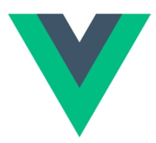

Hello, I'm JiHoon. Today, we're going to look at the front-end framework.<br>We're going to look at four representative things.

## 1. React.js


> It is used by many large companies such as Facebook, Instagram, and Airbnb.

**React.js** is a JavaScript library developed by Facebook to create a declarative and efficient user interface (UI). React is based on a component-based architecture and leverages virtual DOM to improve the performance of web applications.

### Key Feature
1. **Component-based architecture**
React configures the UI as an independent component. Each component manages its own state and combines these components to form an entire application.
 
2. **Virtual DOM**
React interacts efficiently with real-world DOMs using virtual DOMs. It only updates the changes, minimizing actual DOM operations and improving performance.

3. **JSX Grammar**
React creates the UI using JavaScript XML (JSX) grammar. JSX is an extension of JavaScript, which has an XML-like structure but can easily integrate JavaScript code.

4. **One-way data flow**
React follows a one-way data binding. Data is passed from the parent component to the child component, and the child component uses the passed data without changing it.

5. **React Hooks**
Hooks has been introduced to help functional components use features such as state and life cycle methods. There are `useState` and `useEffect`, making it easier to manage the state even in functional components.

### Key Advantages
-   Fast rendering with virtual DOM.
-   Component-based architecture with high modularity and reusability.
-   Scalable for large applications.

## 2. Vue.js



> It is used by Alibaba, Xiaomi, and Nintendo.

**Vue.js** is an intuitive and lightweight front-end JavaScript framework developed by Evan You.Vue.js is a tool for creating user interfaces, designed to build components of single-page applications (SPA) and web applications.

### Key Feature
1. **Single file components**
Vue.js uses a single file component whose screen, logic, and style are separated for each file. This improves the readability of the code and facilitates maintenance.

2. **Bidirectional data binding**
Vue.js supports bidirectional data binding to automatically handle synchronization between the model and the view. This automatically updates the model when the data rendered on the screen changes and vice versa.

3. **Virtual DOM and Declarative Rendering**
Vue.js uses virtual DOM to minimize actual DOM operations and improve performance. In addition, declarative rendering allows you to explicitly express how you want to update the status of your screen.

4. **Component-based architecture**
Vue.js helps you write highly scalable and highly reusable code based on a component-based architecture.

5. **Routing and State Management**
Vue.js provides routing capabilities through Vue Router and state management through Vuex to facilitate SPA development.

### Key Advantages
-   Easy to configure with a single file component.
-   Efficient synchronization between screen and state with two-way data binding.
-   Easy integration makes it easy to work with your library.

## 3. Angular


> It is used by Google, Microsoft, IBM, etc.

**Angular** is a front-end web application framework based on TypeScript developed by Google. Angular is used as a tool to develop single-page applications (SPA) and large web applications, focusing on managing the life cycle of the entire application and integrating multiple functions.

### Key Feature
1. **A complete framework**
Angular is a complete framework that provides basic functions such as routing, HTTP requests, and health management. This integrated structure provides a consistent development environment for developers.

2. **Bidirectional data binding**
Angular supports real-time synchronization between models and views through two-way data binding. Changes in data are automatically reflected on the screen, and your input is also reflected on the model.

3. **Modularization and Dependency Injection**
Angular applications are module-by-module, and each module contains components, services, directives, and so on. Dependency injection enables effective cooperation between components.

4. **Component-based architecture**
Angular uses a component-based architecture to configure applications. Each component manages its own state and view, and you can combine components in parent-child relationships.

5. **Asynchronous programming with RxJS**
Angular utilizes reactive extensions for JavaScript (RxJS) to support asynchronous programming. The Observable pattern makes it easy to handle events and data streams.

6. **A powerful tool ecosystem**
The Angular Line Interface (CLI) facilitates the creation, build, test, and deployment of projects. In addition, Angular provides rich library and community support.

### Key Advantages
-   Automatic updates based on state changes with strong two-way data binding.
-   Modular architecture makes code structured and reusable.
-   Ease of testing enables stable and robust application development.

## 4. Svelte


> Developers are using SvelteKit for a variety of projects.

**Svelte** is a front-end framework and compiler developed by Rich Harris. Svelte optimizes code at the time of compilation, so that no framework code is required at runtime. This provides fast execution speed and small bundle size, and provides concise and intuitive grammar for developers.

### Key Feature
1. **Compiler-based approach**
Svelte uses a compiler to optimize code and convert it into the final JavaScript code. Bundle size is small and execution is fast because no framework code is required at runtime.

2. **Bidirectional data binding**
Like Vue and Angular, Svelte supports bidirectional data binding. This automatically reflects changes in the state on the screen, and user input on the screen affects the model.

3. **Component-based architecture**
Svelte uses a component-based architecture to create reusable and modular code. Each component manages its own status, events, styles, and more.

4. **Easy grammar and easy API**
Svelte provides a concise and intuitive grammar, allowing you to write code quickly. Specifically, a single file structure separated by `<script>`, `<style>`, and `<html>` is used to define the components.

5. **Transitions and Animation**
Svelte provides convenient transitions and easy addition of animation. This makes it easy to apply dynamic and smooth effects to the UI.

### Key Advantages
-   Superior performance with fast execution speed and small bundle size.
-   Simple and developer-friendly grammar.

## Real Code Comparison
Let me give you an example with a simple counter code. It would be nice to compare the codes and decide on the framework.

1. **React.js**
```jsx
import  React, { useState } from  'react';

function  Counter() {
	const [count, setCount] = useState(0);

	return (
		<div>
			<p>Count: {count}</p>
			<button onClick={() => setCount(count + 1)}>Increment</button>
		</div>
	);
}

export  default  Counter;
```

2. **Vue.js**
```html
<template>
	<div>
		<p>Count: {{ count }}</p>
		<button @click="increment">Increment</button>
	</div>
</template>

<script>
export  default {
	data() {
		return { count: 0 };
	},
	methods: {
		increment() {
			this.count++;
		}
	}
};
</script>
```

3. **Angular**
```typescript
import { Component } from  '@angular/core';

@Component({
	selector: 'app-root',
	template: `
		<div>
			<p>Count: {{ count }}</p>
			<button (click)="increment()">Increment</button>
		</div>
	`,
})
export  class  AppComponent {
	count = 0;

	increment() { this.count++;m }
}
```

4. **Svelte**
```svelte
<script>
	let count = 0;

	function increment() {
		count += 1;
	}
</script>

<div>
	<p>Count: {count}</p>
	<button on:click={increment}>Increment</button>
</div>
```

Obviously, based on the code, **Svelte** seems to be the most familiar with grammar. Well, I think I'll think more about what to study. I'm not attracted to the point where I want to study the framework yet, so I'll put it off for the next time.
